# One Select — Platform Flow Guide

Complete end-to-end flow for **One Select** (Hiring Engine): an AI-assisted recruitment platform built with React + Vite, Supabase, and Claude.

---

## Table of Contents

0. [Master Flowchart](#0-master-flowchart)
1. [Platform Overview](#1-platform-overview)
2. [User Roles](#2-user-roles)
3. [Authentication & Onboarding](#3-authentication--onboarding)
4. [End-to-End Hiring Lifecycle](#4-end-to-end-hiring-lifecycle)
5. [Company (Client) Flow](#5-company-client-flow)
6. [Recruiter Flow](#6-recruiter-flow)
7. [Candidate (User) Flow](#7-candidate-user-flow)
8. [Admin Flow](#8-admin-flow)
9. [Public & Token-Based Flows](#9-public--token-based-flows)
10. [Pipeline Stages](#10-pipeline-stages)
11. [Route Map](#11-route-map)
12. [Backend & Integrations](#12-backend--integrations)
13. [Data Model (Key Tables)](#13-data-model-key-tables)
14. [Trial & Billing](#14-trial--billing)

---

## 0. Master Flowchart

### 0.1 — Who enters where (all roles)

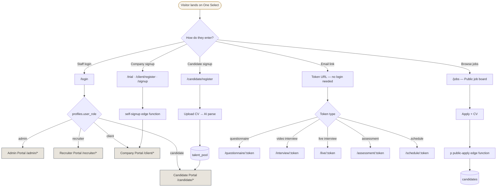

### 0.2 — Complete hiring flowchart (Recruiter + Company + Candidate)

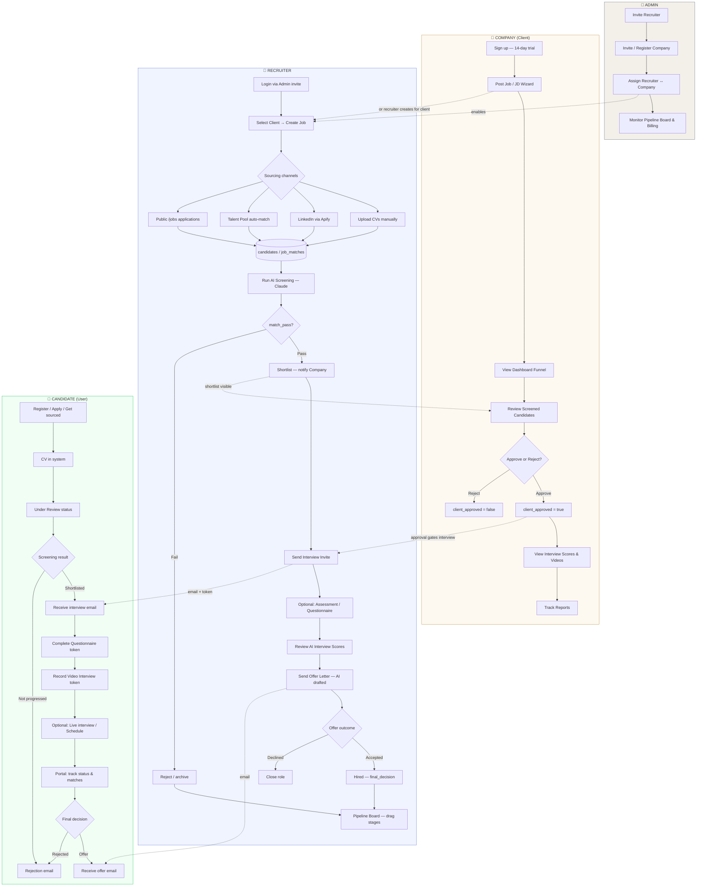

### 0.3 — Candidate pipeline stage flowchart

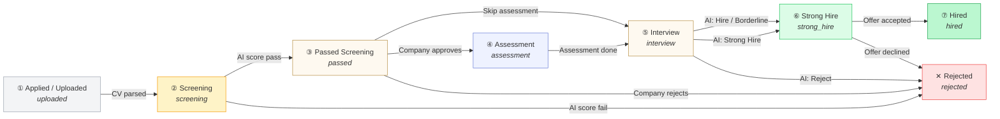

### 0.4 — Decision flowchart (screening → hire)

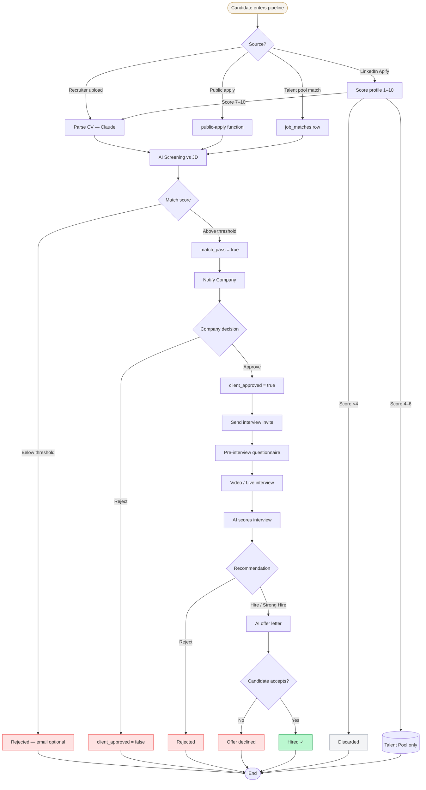

> **Tip:** Open this file in GitHub, VS Code, or Cursor with Mermaid preview to render the diagrams. If a diagram does not render, check that your viewer supports Mermaid `flowchart` syntax.

---

## 1. Platform Overview

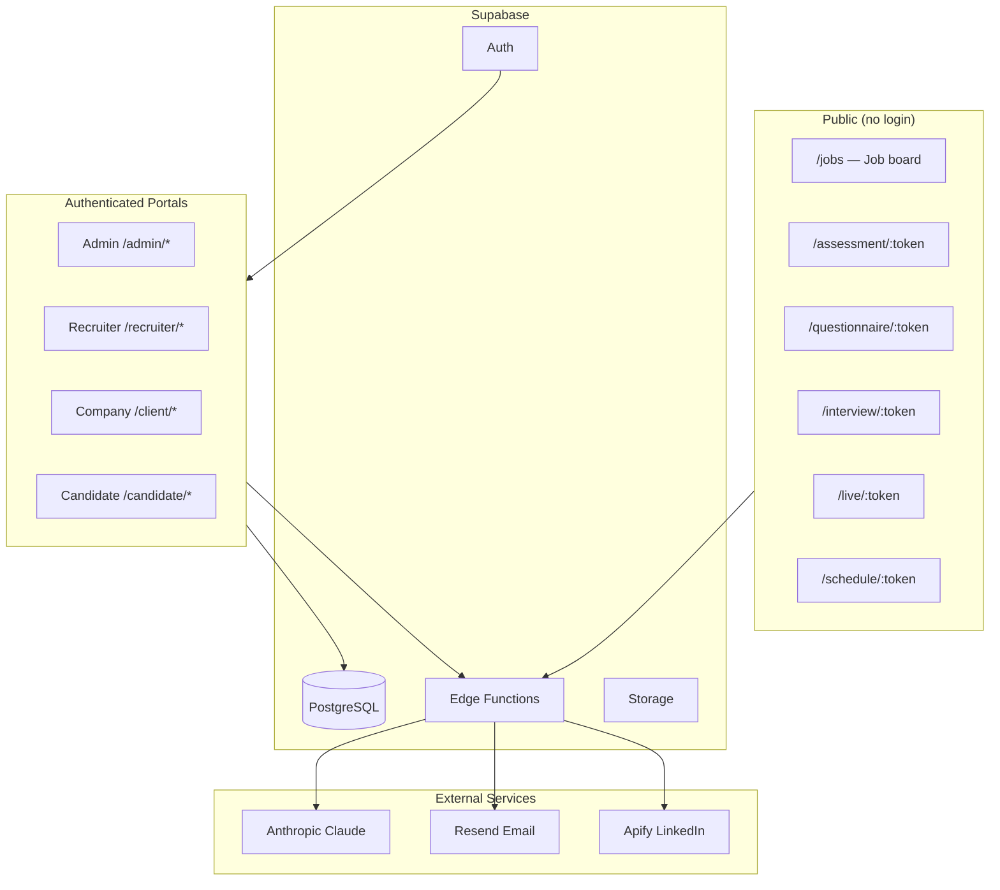

**What the platform does**

| Layer | Purpose |
|-------|---------|
| **Company portal** | Post jobs, review AI-screened candidates, approve/reject, view reports |
| **Recruiter portal** | Manage assigned clients, run sourcing & screening, pipeline, interviews, offers |
| **Candidate portal** | Register profile, view job matches, track application status |
| **Admin portal** | Platform ops: users, billing, compliance, analytics, global pipeline |
| **Public pages** | Job applications, video interviews, assessments, scheduling — all via secure tokens |

---

## 2. User Roles

| Role | `user_role` in `profiles` | Default home | Primary job |
|------|----------------------------|--------------|-------------|
| **Admin** | `admin` | `/admin/dashboard` | Platform management, invite users, billing |
| **Recruiter** | `recruiter` | `/recruiter/dashboard` | Execute hiring for assigned companies |
| **Company (Client)** | `client` | `/client/dashboard` | Own jobs & candidates; approve shortlists |
| **Candidate (User)** | `candidate` | `/candidate/dashboard` | Profile, matches, application tracking |

**Access control**

- `ProtectedRoute` in `src/App.jsx` checks Supabase session + `profiles.user_role`
- Wrong role → redirected to that role's dashboard
- Missing profile → `/login?error=profile_missing`

---

## 3. Authentication & Onboarding

### 3.1 Login (`/login`)

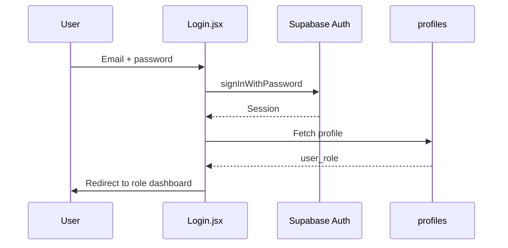

**Special auth flows**

| Flow | URL signal | Behaviour |
|------|------------|-----------|
| **Invite** | `?type=invite` or invite email link | Set password on first login → role dashboard |
| **Magic link** | `?code=` (no type) | Auto sign-in → role dashboard |
| **Password reset** | `?type=recovery` | New password form → sign in |
| **Auth callback** | `/auth/callback`, `/auth/confirm` | Root redirect by role |

### 3.2 Company registration paths

| Path | URL | Result |
|------|-----|--------|
| Self-signup | `/client/register` | `self-signup` edge function → 14-day trial client |
| Trial landing | `/trial` | Same as above with explicit trial metadata |
| General signup | `/signup` | Company trial account via `self-signup` |
| Admin invite | Admin → Clients → Invite | Magic link email (no plaintext password) |

### 3.3 Recruiter onboarding

```mermaid
flowchart LR
    A[Admin invites recruiter] --> B[invite-user edge function]
    B --> C[Magic link email]
    C --> D[Recruiter sets password]
    D --> E[/recruiter/dashboard]
    A2[Admin assigns clients] --> F[recruiter_clients table]
    F --> E
```

### 3.4 Candidate registration

| Path | URL | Flow |
|------|-----|------|
| Direct register | `/candidate/register` | CV upload → AI parse → `talent_pool` + auth account |
| Public job apply | `/jobs` → Apply | `public-apply` edge function → `candidates` row |
| Recruiter upload | Recruiter job view | CV parse → `candidates` (no portal account unless linked later) |

---

## 4. End-to-End Hiring Lifecycle

This is the core business flow spanning all roles.

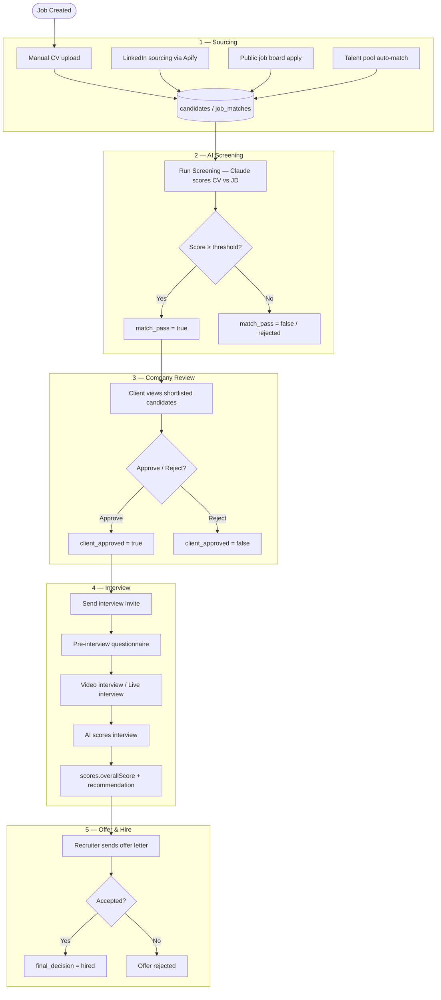

### Lifecycle by actor

| Step | Who triggers | Who sees result |
|------|--------------|-----------------|
| Job created | Recruiter, Company, or Admin | All assigned parties |
| CV sourced | Recruiter, LinkedIn, Public apply, Talent pool | Recruiter |
| AI screening | Recruiter | Recruiter + Company |
| Client approval | Company | Recruiter |
| Interview invite | Recruiter | Candidate (email + token link) |
| Interview completion | Candidate | Recruiter + Company |
| Offer letter | Recruiter | Candidate (email) |
| Hire / reject | Recruiter or Pipeline board | All parties + audit log |

---

## 5. Company (Client) Flow

**Portal:** `/client/*`  
**Nav:** Dashboard → My Jobs → Candidates → Reports → AI Assistant → Settings

### 5.1 Onboarding

```mermaid
flowchart TD
    A[Visit /trial or /client/register] --> B[Fill company details]
    B --> C[self-signup edge function]
    C --> D[profiles: user_role=client, is_trial=true]
    D --> E[Auto sign-in]
    E --> F[/client/dashboard?welcome=1]
```

### 5.2 Day-to-day workflow

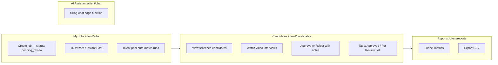

### 5.3 Company actions detail

| Action | Where | Effect |
|--------|-------|--------|
| Post job | `/client/jobs` | Job created (`pending_review` or `active`); talent pool scan starts |
| View candidates | `/client/candidates` | Sees only own jobs' candidates (RLS) |
| Approve candidate | Candidate row / profile | `client_approved = true`, audit `client_approved` |
| Reject candidate | Candidate row / profile | `client_approved = false`, notes saved |
| View interview | Video modal | Plays recorded answers + AI dimension scores |
| AI chat | `/client/chat` | Context-aware hiring assistant |
| Settings | `/client/settings` | Company profile, stakeholders, notifications |

### 5.4 Company restrictions

| State | Behaviour |
|-------|-----------|
| **Trial active** | Full access with soft caps (2 jobs, 25 candidates visible, 15 screenings, etc.) |
| **Trial ending** | Amber nudge banner at 80% of any cap |
| **Trial expired** | Full-screen block; contact sales |
| **Suspended** | Billing hold screen; no portal access |

---

## 6. Recruiter Flow

**Portal:** `/recruiter/*`  
**Nav:** Dashboard → Clients → Jobs → Candidates → Talent Pool → LinkedIn Pool → Talent CRM → Pipeline → Reports → AI Assistant → Settings

### 6.1 Setup

1. Admin invites recruiter via `/admin/recruiters`
2. Recruiter clicks magic link → sets password
3. Admin assigns companies via `recruiter_clients` join table
4. Recruiter sees assigned clients at `/recruiter/clients`

### 6.2 Core workflow

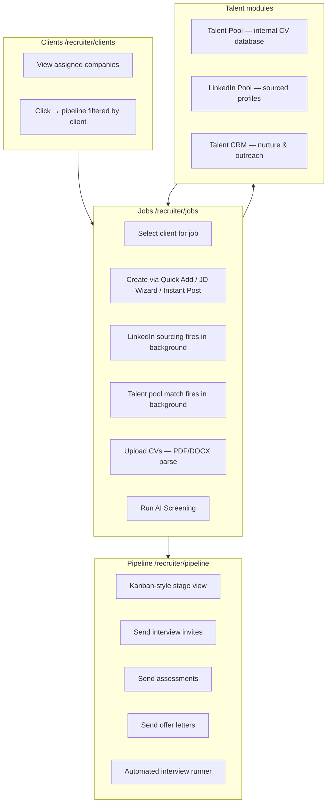

### 6.3 Recruiter actions detail

| Action | Where | Backend |
|--------|-------|---------|
| Create job | `/recruiter/jobs` | `jobs` insert + `source-linkedin-candidates` + `triggerTalentPoolMatch` |
| Upload CV | Job detail | `fileExtract` + Claude parse → `candidates` |
| Run screening | Job detail | `call-claude` scores each CV vs JD |
| Score feedback | Candidate profile | 👍/👎 saved for model calibration |
| Send video interview | Candidate / pipeline | `send-ai-interview-invite` → token URL `/interview/:token` |
| Send live interview | Candidate / pipeline | `send-live-interview-invite` → `/live/:token` |
| Send assessment | Candidate | `send-assessment-invite` → `/assessment/:token` |
| Send offer | Approved candidate | `send-offer-letter` → AI-drafted letter via email |
| Reject | Candidate | `send-rejection-email` |
| AI assistant | `/recruiter/chat` | `recruiter-chat` edge function |
| Reports | `/recruiter/reports` | Per-client hiring metrics |

### 6.4 LinkedIn sourcing flow

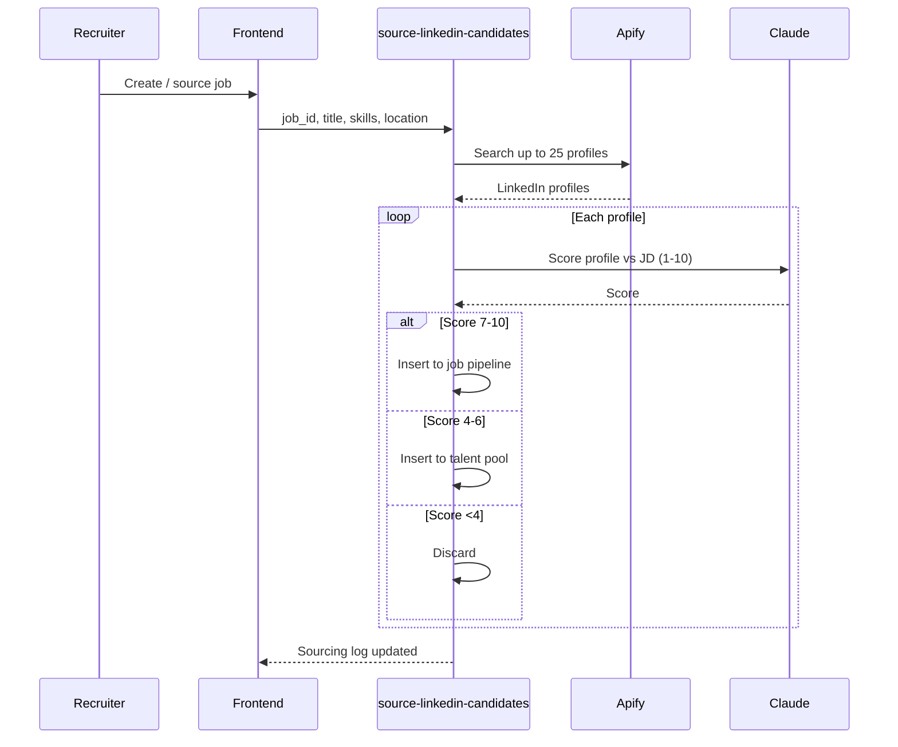

---

## 7. Candidate (User) Flow

**Portal:** `/candidate/*`  
**Nav:** Dashboard → My Matches → My Profile

### 7.1 Registration

```mermaid
flowchart TD
    A[/candidate/register] --> B[Upload CV PDF/DOCX]
    B --> C[Claude extracts name, skills, experience]
    C --> D[Complete profile form]
    D --> E[Create auth account]
    E --> F[talent_pool row linked via candidate_user_id]
    F --> G[/candidate/dashboard]
```

### 7.2 Candidate journey (no login required for interviews)

```mermaid
flowchart LR
    subgraph Portal["Logged-in portal"]
        D1[Dashboard — profile completeness %]
        D2[My Matches — AI-matched jobs]
        D3[My Profile — edit skills, CV]
        D4[Application status tracking]
    end

    subgraph Email["Email token links"]
        E1[/questionnaire/:token]
        E2[/interview/:token]
        E3[/live/:token]
        E4[/assessment/:token]
        E5[/schedule/:token]
    end

    Portal --> Email
```

### 7.3 Status visibility (candidate sees)

| Status | Meaning |
|--------|---------|
| Under review | CV being assessed |
| Shortlisted | Passed screening; interview invite coming |
| Interview reviewed | AI scored interview; decision pending |
| Offer made | `final_decision = hired` path |
| Not progressed | Rejected at screening or final |

### 7.4 Data sources for candidate dashboard

| Source | Table | When used |
|--------|-------|-----------|
| Talent pool profile | `talent_pool` | Registered candidate |
| AI matches | `job_matches` | Pool entries matched to jobs |
| Direct applications | `candidates` | Applied via `/jobs` or recruiter upload with linked account |
| Upcoming interviews | `interview_bookings` | Confirmed scheduling |

---

## 8. Admin Flow

**Portal:** `/admin/*`  
**Nav:** Dashboard, Clients, Recruiters, Jobs, Talent Pool, LinkedIn Pool, Talent CRM, Sourcing, Pipeline, Pipeline Board, Compliance, Analytics, Billing, Settings

### 8.1 Admin responsibilities

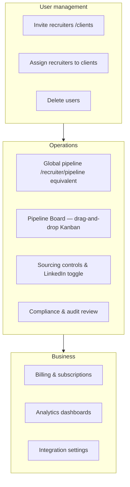

### 8.2 Admin-only capabilities

| Feature | Route | Notes |
|---------|-------|-------|
| Invite users | `/admin/recruiters`, `/admin/clients` | Magic link via `invite-user` |
| Global jobs | `/admin/jobs` | Create jobs for any recruiter |
| Pipeline board | `/admin/board` | Drag cards between stages; logs `stage_move` |
| Billing | `/admin/billing` | Subscription management |
| Compliance | `/admin/compliance` | GDPR / data retention |
| Analytics | `/admin/analytics` | Platform-wide metrics |
| Demo seed | Admin dashboard | `DemoLoader` — seeds sample job + 8 candidates |

---

## 9. Public & Token-Based Flows

These pages require **no login** — access is via secure tokens in URLs.

### 9.1 Public job board (`/jobs`)

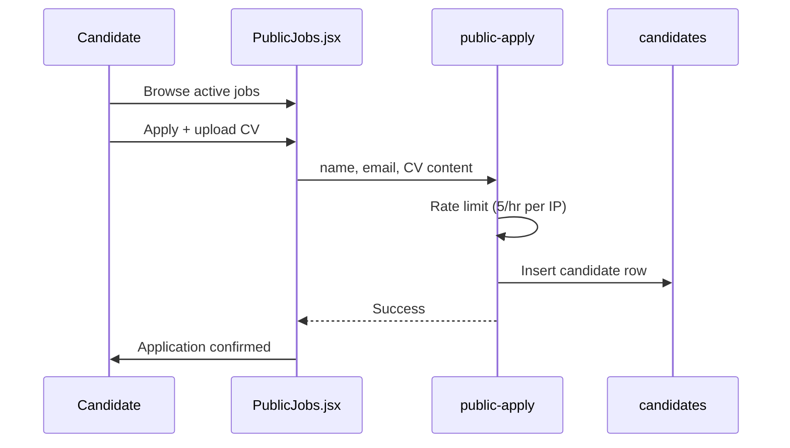

### 9.2 Token-based candidate experiences

| Route | Token field | Purpose |
|-------|-------------|---------|
| `/questionnaire/:token` | `interview_invite_token` | Pre-interview form (notice period, salary, right to work) |
| `/interview/:token` | `interview_invite_token` | Async video interview (record answers) |
| `/live/:token` | live interview token | Live video interview session |
| `/schedule/:token` | schedule token | Confirm interview slot (Cal.com integration) |
| `/assessment/:token` | `assessment_tokens.token` | Custom written assessment |

### 9.3 Video interview flow

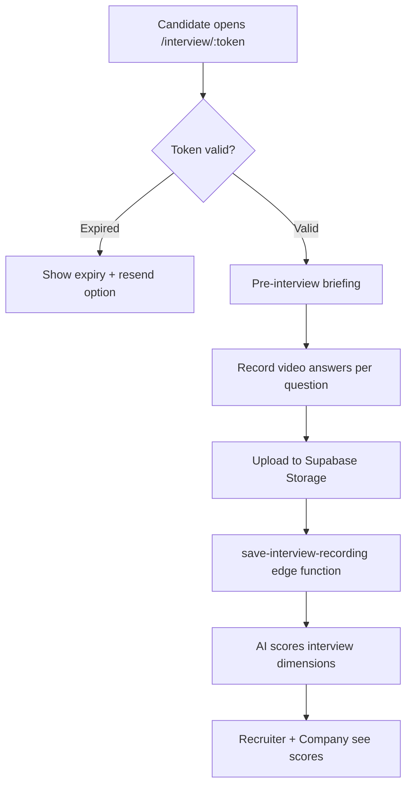

---

## 10. Pipeline Stages

### Kanban board columns (`AdminBoard`)

| Stage | Label | Typical entry condition |
|-------|-------|------------------------|
| `uploaded` | Applied / Uploaded | CV received, not yet screened |
| `screening` | Screening | `match_score` exists |
| `passed` | Passed Screening | `match_pass = true` |
| `assessment` | Assessment | Assessment sent/completed |
| `interview` | Interview | Interview invite sent or scored |
| `strong_hire` | Strong Hire | `scores.recommendation = Strong Hire` |
| `hired` | Hired | `final_decision = hired` |
| `rejected` | Rejected | Failed screening or rejected |

### Reporting funnel stages (`api.js`)

`sourced` → `screened` → `interviewed` → `shortlisted` → `offered`

### Stage transitions

- **Automatic:** Screening sets `match_pass`; interview scoring sets `scores`
- **Manual:** Drag on Pipeline Board → `stage_move` audit event
- **Client:** Approve/reject sets `client_approved`
- **Final:** Offer/hire sets `final_decision`

---

## 11. Route Map

### Public routes

| Route | Page |
|-------|------|
| `/` | Redirect by role (or `/login`) |
| `/login` | Staff login (admin, recruiter, client) |
| `/signup` | Company trial signup |
| `/trial` | Trial landing signup |
| `/client/register` | Company self-registration |
| `/candidate/login` | Candidate login |
| `/candidate/register` | Candidate registration |
| `/jobs` | Public job board |
| `/privacy` | Privacy policy |
| `/terms` | Terms of service |
| `/questionnaire/:token` | Pre-interview questionnaire |
| `/interview/:token` | Video interview |
| `/live/:token` | Live interview |
| `/schedule/:token` | Schedule confirmation |
| `/assessment/:token` | Written assessment |
| `/auth/callback` | Supabase auth redirect |
| `/auth/confirm` | Supabase email confirm |

### Admin routes (`/admin/*`)

| Route | Page |
|-------|------|
| `/admin/dashboard` | Admin dashboard |
| `/admin/clients` | Manage companies |
| `/admin/recruiters` | Manage recruiters |
| `/admin/jobs` | All jobs |
| `/admin/talent-pool` | Internal talent database |
| `/admin/linkedin-pool` | LinkedIn-sourced profiles |
| `/admin/talent-crm` | CRM / outreach |
| `/admin/sourcing` | Sourcing controls |
| `/admin/pipeline` | Global pipeline runner |
| `/admin/board` | Kanban pipeline board |
| `/admin/compliance` | Compliance |
| `/admin/billing` | Billing |
| `/admin/analytics` | Analytics |
| `/admin/settings` | Platform settings |

### Recruiter routes (`/recruiter/*`)

| Route | Page |
|-------|------|
| `/recruiter/dashboard` | Recruiter dashboard |
| `/recruiter/clients` | Assigned companies |
| `/recruiter/jobs` | Job management + CV upload + screening |
| `/recruiter/candidates` | All candidates across jobs |
| `/recruiter/talent-pool` | Talent pool (shared component) |
| `/recruiter/linkedin-pool` | LinkedIn pool |
| `/recruiter/talent-crm` | Talent CRM |
| `/recruiter/pipeline` | Pipeline per client/job |
| `/recruiter/reports` | Reports |
| `/recruiter/chat` | AI assistant |
| `/recruiter/settings` | Settings |

### Company routes (`/client/*`)

| Route | Page |
|-------|------|
| `/client/dashboard` | Company dashboard + funnel |
| `/client/jobs` | Post & manage jobs |
| `/client/candidates` | Review & approve candidates |
| `/client/reports` | Hiring reports |
| `/client/chat` | AI assistant |
| `/client/settings` | Company settings |

### Candidate routes (`/candidate/*`)

| Route | Page |
|-------|------|
| `/candidate/dashboard` | Profile score, matches, applications |
| `/candidate/matches` | All AI-matched roles |
| `/candidate/profile` | Edit profile & CV |

---

## 12. Backend & Integrations

### Supabase Edge Functions (key)

| Function | Triggered by | Purpose |
|----------|--------------|---------|
| `self-signup` | Company/candidate registration | Create auth user + profile |
| `invite-user` | Admin invite | Magic link for new users |
| `call-claude` | Screening, parsing, chat | All AI calls (server-side) |
| `public-apply` | `/jobs` apply form | Rate-limited public applications |
| `source-linkedin-candidates` | Job creation | Apify LinkedIn search + AI scoring |
| `send-ai-interview-invite` | Recruiter | Video interview email + token |
| `send-live-interview-invite` | Recruiter | Live interview invite |
| `send-assessment-invite` | Recruiter | Assessment token email |
| `send-offer-letter` | Recruiter | AI-drafted offer email |
| `send-rejection-email` | Recruiter | Rejection notification |
| `send-screening-update` | Pipeline | Candidate status email |
| `save-interview-recording` | Video interview | Store + process recordings |
| `hiring-chat` | Client AI chat | Context-aware assistant |
| `recruiter-chat` | Recruiter AI chat | Recruiter assistant |
| `notify-client-shortlist` | Screening complete | Alert company of new matches |
| `client-approval-nudge` | Cron | Remind clients to review |
| `weekly-talent-match` | Cron | Auto-match talent pool to jobs |
| `talent-reengagement` | Cron | Re-engage stale pool candidates |
| `cleanup-stale-data` | Cron | Data retention |

### External services

| Service | Secret | Used for |
|---------|--------|----------|
| **Anthropic** | `ANTHROPIC_API_KEY` | CV screening, interview scoring, JD analysis, chat |
| **Resend** | `RESEND_API_KEY` | All transactional email |
| **Apify** | `APIFY_API_TOKEN` | LinkedIn profile search |

---

## 13. Data Model (Key Tables)

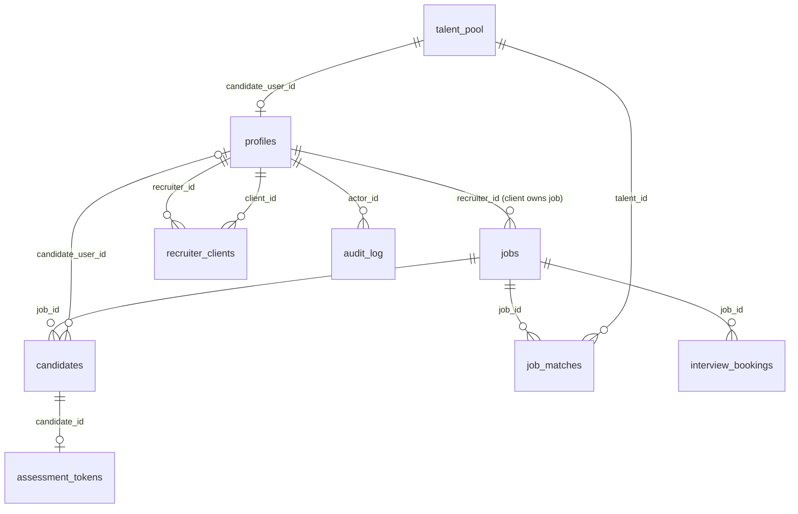

| Table | Purpose |
|-------|---------|
| `profiles` | User identity, role, company, trial/billing status |
| `recruiter_clients` | Many-to-many: which recruiter serves which company |
| `jobs` | Job postings (owned by company via `recruiter_id`) |
| `candidates` | Per-job applicant records (CV, scores, stage, approval) |
| `talent_pool` | Central candidate database (registered + imported) |
| `job_matches` | Talent pool ↔ job AI matches |
| `linkedin_sourcing_log` | LinkedIn sourcing run history |
| `assessment_tokens` | Tokenized written assessments |
| `interview_bookings` | Scheduled live interviews |
| `audit_log` | Immutable action log (`job_created`, `client_approved`, `stage_move`, etc.) |
| `ip_rate_limits` | Public apply rate limiting |

---

## 14. Trial & Billing

### Trial limits (`src/config/trialLimits.js`)

| Cap | Limit | Behaviour |
|-----|-------|-----------|
| Jobs | 2 | Soft cap |
| Visible candidates | 25 | Soft cap |
| AI screenings | 15 | Nudge at 80% |
| AI chat messages | 20 | Nudge at 80% |
| LinkedIn sourcing runs | 2 | Nudge at 80% |
| Trial duration | 14 days | Full block when expired |

**Trial includes:** AI screening, interview invites, full profiles, pipeline, offers, chat  
**Trial excludes:** Report downloads, HRIS webhooks

### Subscription states (`profiles`)

| Status | Portal access |
|--------|---------------|
| `trial` (active) | Full with soft caps |
| `active` | Paid — no caps |
| `expired` | Blocked — contact sales |
| `suspended` | Blocked — billing hold |

---

## Quick Reference — Role Permissions

| Capability | Admin | Recruiter | Company | Candidate |
|------------|:-----:|:---------:|:-------:|:---------:|
| Invite users | ✓ | — | — | — |
| Create jobs | ✓ | ✓ (assigned clients) | ✓ (own) | — |
| Upload / source CVs | ✓ | ✓ | — | ✓ (own profile) |
| Run AI screening | ✓ | ✓ | View results | — |
| Approve candidates | — | — | ✓ | — |
| Send interviews | ✓ | ✓ | — | Take (via token) |
| Send offers | ✓ | ✓ | — | Receive |
| Pipeline board | ✓ | ✓ | — | — |
| Billing | ✓ | — | — | — |
| View other companies' data | ✓ | — | — | — |

---

## Demo Walkthrough (Happy Path)

Reference: `SMOKE_TEST.md`

1. **Admin** invites recruiter → `/admin/recruiters`
2. **Recruiter** logs in, creates job → `/recruiter/jobs`
3. **Recruiter** uploads 3 CVs, runs screening
4. **Recruiter** sends video interview to top candidate
5. **Company** logs in, views candidates → `/client/candidates`
6. **Company** approves a candidate
7. **Recruiter** sends AI-drafted offer letter
8. **Admin** verifies `audit_log` entries

---

*Generated from codebase analysis. Stack: React 19 + Vite 8 + Supabase + Claude. Deployed on Vercel with SPA rewrites.*
